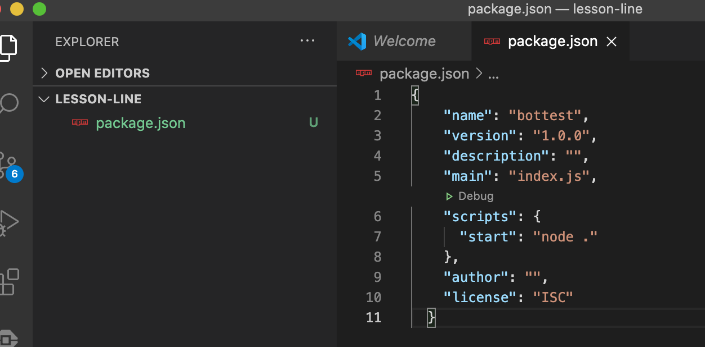
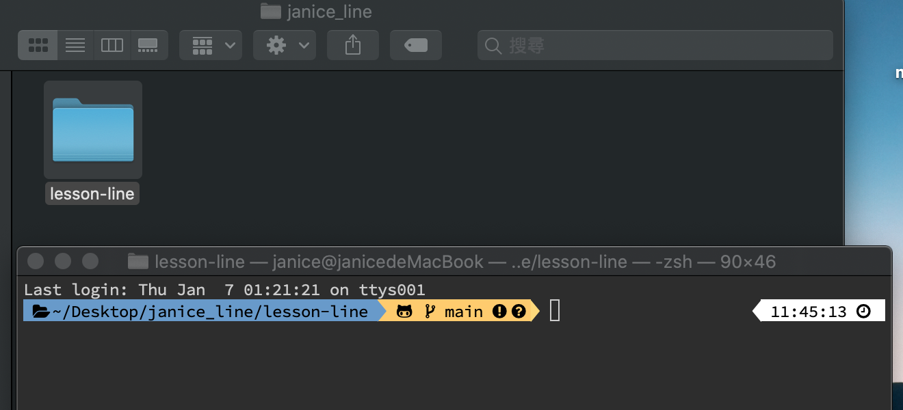
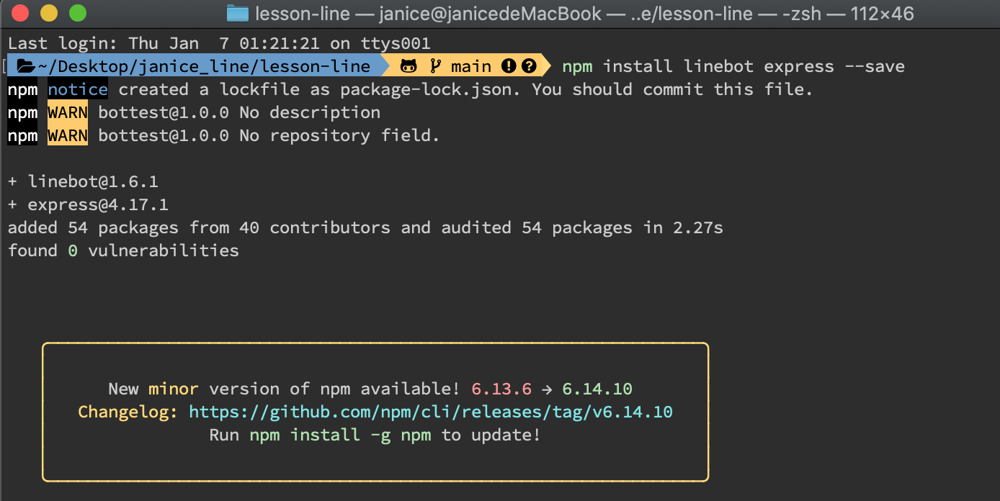
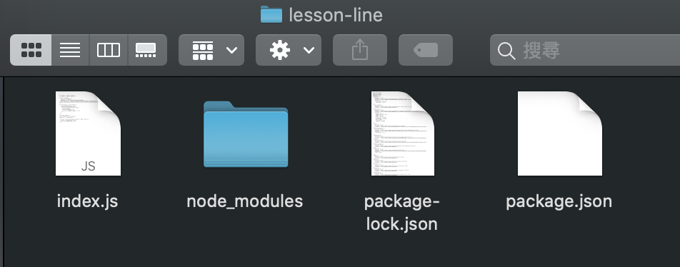
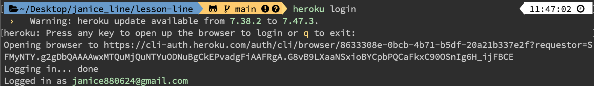
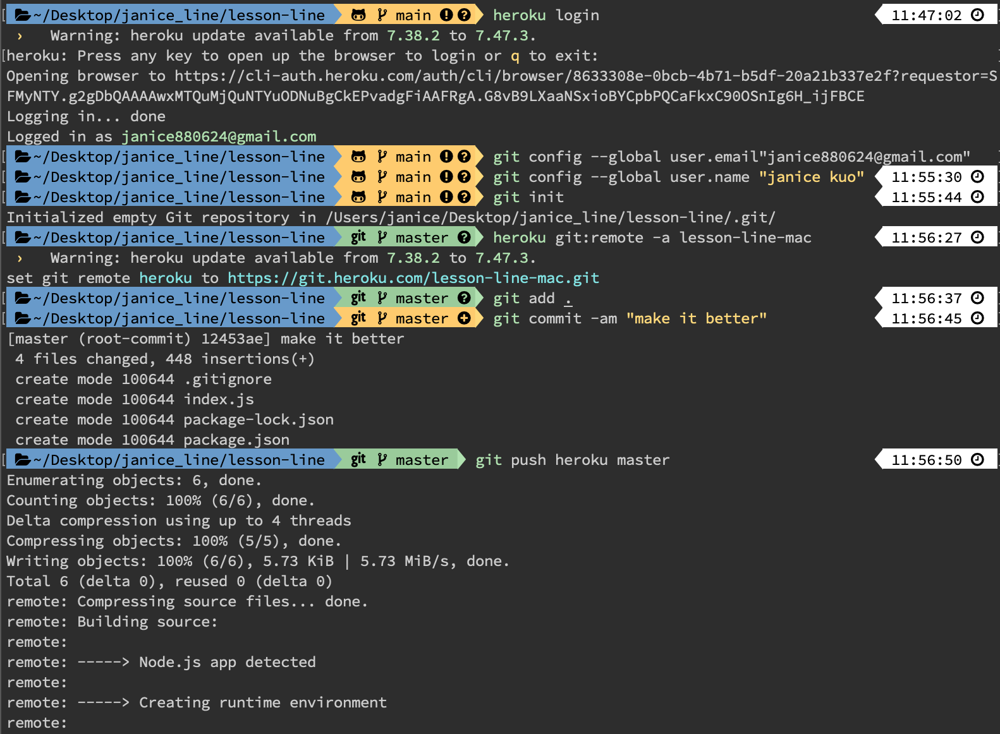
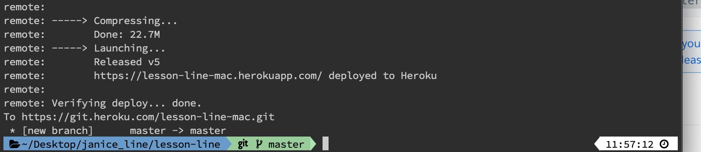
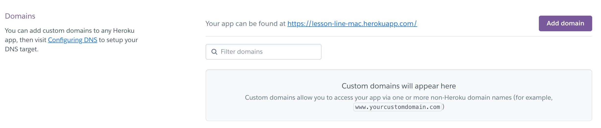

# 建立第一個程式 🐦- mac

## 👉 建立一個資料夾📁 \(自行命名\)


## 👉 建立一個`package.json`的純文字檔案📄，並輸入內容如下\(name 請根據你建的檔案輸入\)



```text
{
  "name": "bottest",
  "version": "1.0.0",
  "description": "",
  "main": "index.js",
  "scripts": {
    "start": "node ."
  },
  "author": "",
  "license": "ISC"
}
```

## 👉 開啟【terminal】，並連結到自己的資料夾



## 👉 為了讓Node.js和Line溝通，要安裝 linebot 和 express 這二個模組，指令如下

```text
npm install linebot express --save
```



## 👉 完成後，剛剛的 `package.json` 會多出【dependencies 】


## 👉 在資料夾中建立一個`index.js`檔案📄，內容如下

```javascript
var linebot = require('linebot');
var express = require('express');

var bot = linebot({
  channelId: '你自己Line的channelId',
  channelSecret: '你自己Line的channelSecret',
  channelAccessToken: '你自己Line的channelAccessToken'
});

bot.on('message', function(event) {
  if (event.message.type = 'text') {
    var msg = event.message.text;
    event.reply(msg).then(function(data) {
      console.log(msg);
    }).catch(function(error) {
      console.log('錯誤產生，錯誤碼：'+error);
    });
  }
});

const app = express();
const linebotParser = bot.parser();
app.post('/', linebotParser);

var server = app.listen(process.env.PORT || 8080, function() {
  var port = server.address().port;
  console.log('目前的port是', port);
});
```

## 👉 在資料夾中建立一個`.gitignore`檔案📄，內容如下

```javascript
node_modules
```

## 👉 做到這一步資料夾內部文件如下



## 👉 登入 heroku



## 👉 將檔案上傳（所有指令都要輸入喔！！）



## 👉 成功的話會看到一個網址



## 👉 回到 heroku 【Settings】中的【Domains】 複製右側網址



