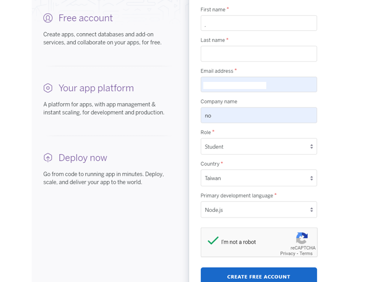

# 申請 Heroku 帳號


Heroku 👉 [https://www.heroku.com/](https://www.heroku.com/)


#### step1. 申請 Heroku 帳號

#### step2. 填寫資料，語言選擇 【Node.js】，完成後按下建立

#### step3. 按下【New】開啟選單，點選【Create new app】

#### step4. 輸入【App name】，然後點選【Create app】

#### step5. 到【Setting】的頁面

#### step6. 在【Config Vars】 輸入剛剛 Line 的ChannelAccessToken和ChannelSecret資訊

📢請用複製的不要自己打，它真滴很長喔!!!!

