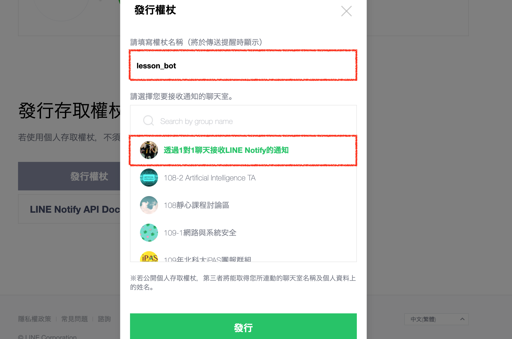
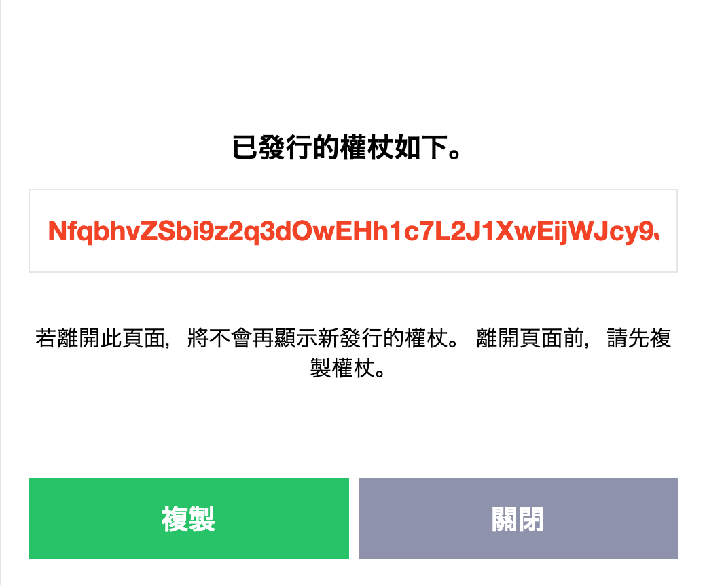
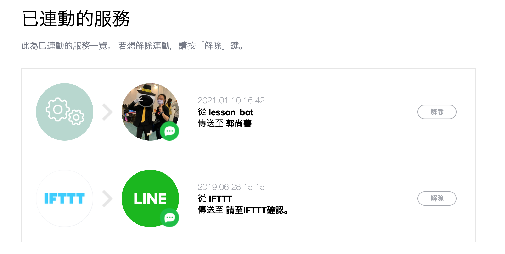
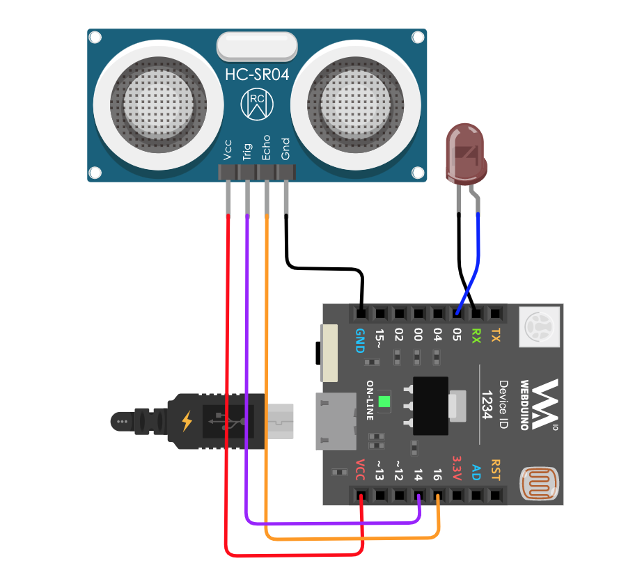
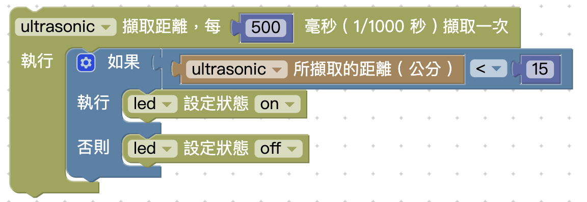
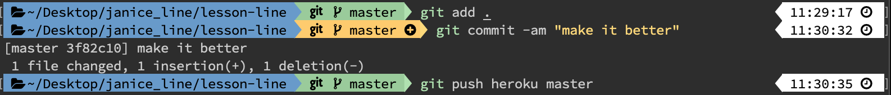

# 智能監控裝置

### 👉 申請 LINE Notify 權杖

#### step1. 連到申請網站


申請權杖：[https://notify-bot.line.me/zh\_TW/](https://notify-bot.line.me/zh_TW/)



#### step2. 登入個人帳號\(點選右上角登入\)


#### step3.  點選【個人頁面】


#### step4. 發行權杖


#### step5. 指定權杖名稱



#### step6. 複製權杖





#### step7. 查看是否成功




### 👉 硬體接線



### 👉 程式修改

#### step1. 安裝套件

在 terminal 或者 cmd 輸入以下兩個指令安裝

`npm install line-notify-nodejs`

```javascript
const lineNotify = require('line-notify-nodejs')('你的權杖');

lineNotify.notify({
   message: '智慧監控裝置已連線',
}).then(() => {
   console.log('send completed!');
});
```

#### step2. 定義元件


```javascript
var ultrasonic; // 元件
var led; // 元件
var pin; //接地腳
var ul_trig = 14; // 超音波 trig 腳
var ul_echo = 16; // 超音波 echo 腳
var led_pin = 5; // led 數位腳

boardReady(myBoardVars, true, function (board) {
   myBoard = board;
   board.systemReset();
   board.samplingInterval = 50;
   rgbled = getRGBLedCathode(board, 15, 12, 13);
   
   // 新增以下4行
   led = getLed(board, led_pin);
   pin = getPin(board, 3);
   pin.write(0);
   ultrasonic = getUltrasonic(board, ul_trig, ul_echo);
});
```

#### step3. 判斷條件



```javascript
// 開發版設定
boardReady(myBoardVars, true, function (board) {
   // 前面顯示過，我就先省略喔！！

   // 超音波自動偵測
   ultrasonic.ping(function (cm) {
      if (ultrasonic.distance < 15) {
         led.on();
         lineNotify.notify({
            message: '抓小偷了喔',
         }).then(() => {
            console.log('send completed!');
         });
      } else {
         led.off();
      }
   }, 500);
});
```

### 👉 上傳 3 步驟

1. `git add .`
2. `git commit -am "註解"`
3. `git push heroku master`



